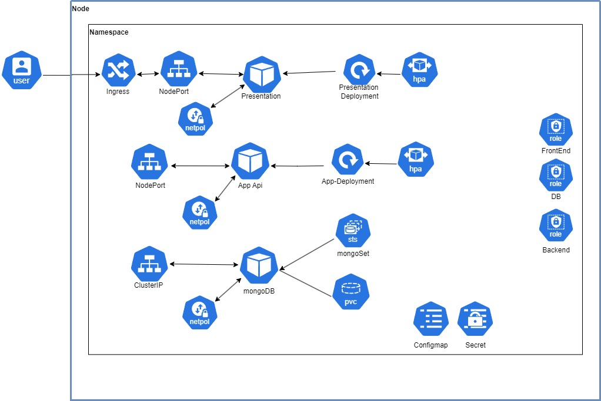

# XM_0091-Software_Containerization
This repository contains the source code of a 3-tier application that is containerized using Docker and deployed on Kubernetes. The application is a simple reminder app that allows users to add reminders.

## Contributors
You can find the repository at https://github.com/Leodom01/XM_0091-Software_Containerization

Contributors:
- Leonardo Dominici
- Dalvie Benu
- Minh Duc Nguyen

## Running the Application
In order to run the app reachable at http://localhost:30002/, you need to follow the steps below.
### 1. Setting Up Persistent Volume
```bash
kubectl apply -f dbTier/dbPersistentVolume.yaml
```

### 2. Installation of 3-tier Application using Helm
```bash
helm install -g app-deployment/
```

### 3. Enabling TLS
Add "127.0.0.1 reminder.com" to /etc/hosts in order to access the app via http://reminder.com and 
```bash
helm install -g tls/
```

### Disabling the Application
````bash
helm uninstall app-deployment-<release-number>
````
```bash
kubectl delete -f dbTier/dbPersistentVolume.yaml
```
```bash
helm uninstall tls-<release-number>
```

## Application Architecture


## Requirements
### Persestent Layer
- Directory: dbTier
- Image: mongo
- Deployed as: StatefulSet
- Service: ClusterIP

### REST API
- Directory: apiTier
- Framework: Flask
- Deployed as: Deployment
- Service: NodePort
- Scaling: Horizontal Pod Autoscaler

### Web Frontend
- Directory: webTier
- Framework: Vue.js
- Deployed as: Deployment
- Service: NodePort
- Scaling: Horizontal Pod Autoscaler

### TLS
- Directory: tls
- Self-made certificate authority with cer-manager
- Ingress for rerouting traffic from http to https


### Helm Chart
- Directory: app-deployment
- Helm chart for deploying the 3-tier application

### Security - Network Policies
- presentation tiert: only accepts traffic from the apiTier
- api tier: only accepts traffic from the presentationTier and the db tier
- db tier: only accepts traffic from the api tier

### Security - RBAC
- Service account for each tier
- get, watch, list for certain resources 
- Roles: frontend, backend, db


### Google Cloud Platform
- Deployment on GKE (as seen in the presentation)
- Persistent Volume on GCP uses standard-rwo storage class


